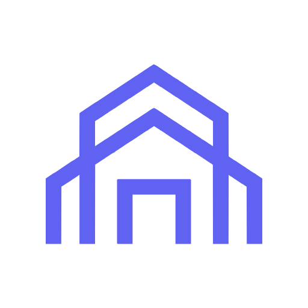

  

# CalleMedio

**Software studio building SaaS products** — cloud-native, multi-tenant platforms for real-world industries. Based in Miami, FL.

🌐 **Website:** [callemedio.github.io](https://callemedio.github.io)

## Products

| Product | What it is | Status |
|---|---|---|
| **[ShellCondo](https://www.shellcondo.com)** | SaaS platform for HOA & condominium management | 🟢 Live |
| **ShellVendor** | Vendor & field-service management SaaS for cleaning, landscaping, plumbing and electrical companies | 🟡 In design |
| **Ventis** | Censorship-resistant VPN with traffic obfuscation and voucher-based activation, built for the Latin American diaspora and their families | 🔵 In development |

## How we build

.NET • React • Azure • Multi-tenant architecture

## Who's behind it

Founded by [José Unanue](https://github.com/neounanue) — senior software engineer with ~19 years of experience. [Personal site](https://neounanue.github.io) · [LinkedIn](https://www.linkedin.com/in/unanue/)

📫 **Contact:** jose.unanue@hotmail.com
